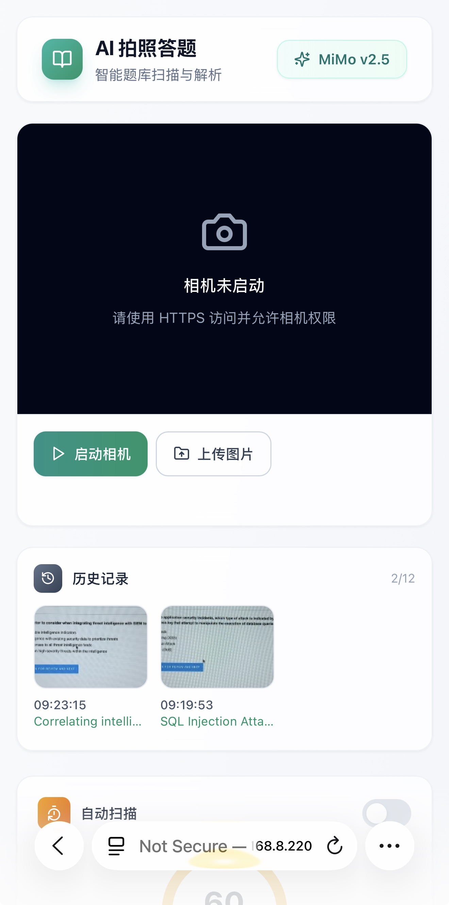
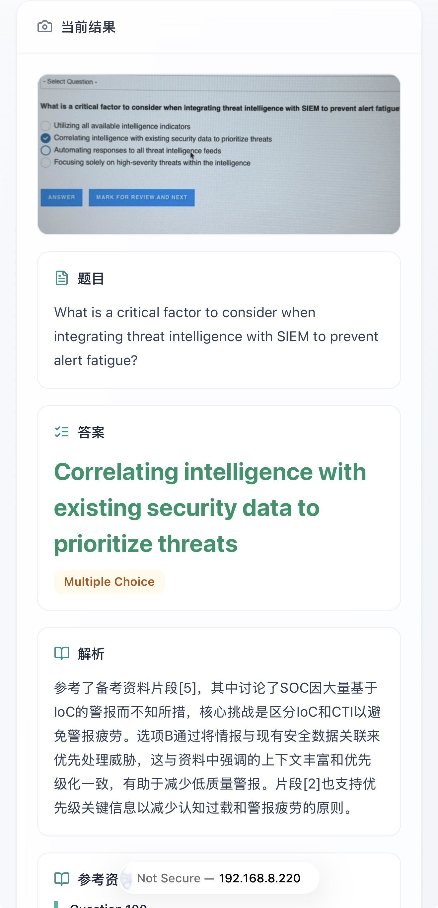

# AI 拍照答题 / AI Exam Scanner


[English](#english) | [中文](#中文)

---

## English

### Overview

A modern AI-powered exam scanning tool designed for mobile browsers. Capture or upload question images, and get instant answers with explanations powered by Xiaomi MiMo API.

### Features

- **Camera Scanning**: Real-time camera access with auto-scan timer
- **Question Bank Import**: Import your own question banks (JSON, CSV, TXT, MD formats)
- **Bilingual UI**: Switch between Chinese and English
- **History**: Track your scan history with thumbnails
- **Model Settings**: Configure API key, base URL, and model name
- **Modern UI**: Clean, minimalist design with glassmorphism effects

### Screenshots

<p align="center">
  
  &nbsp;&nbsp;
  
</p>

### Quick Start

#### Local Development

```bash
npm install
npm run dev
```

Visit `http://localhost:3000`. The camera requires HTTPS on mobile devices.

#### Docker Deployment

```bash
# Copy environment file
cp .env.example .env.local

# Edit .env.local with your API key
# MIMO_API_KEY=your_api_key_here

# Build and run
docker compose up -d --build
```

Access at `https://localhost:8443`

### Environment Variables

Copy `.env.example` to `.env.local`:

```bash
MIMO_API_KEY=your_api_key
MIMO_BASE_URL=https://token-plan-sgp.xiaomimimo.com/v1
MIMO_MODEL=mimo-v2.5
```

### Question Bank Format

Supports multiple formats:

#### JSON
```json
[
  {
    "question": "What is 1+1?",
    "answer": "2",
    "explanation": "Basic arithmetic"
  }
]
```

#### CSV
```csv
question,answer,explanation
"What is 1+1?","2","Basic arithmetic"
```

#### TXT/MD
```
1. What is 1+1?
A. 1
B. 2
C. 3
D. 4
答案：B
解析：Basic arithmetic
```

### HTTPS Certificates

For local HTTPS development:

```bash
npm run dev:https
```

To trust the certificate on iPhone:
1. Send `certs/local-ca.crt` to your iPhone
2. Install the profile in Settings
3. Enable trust in Settings -> General -> About -> Certificate Trust Settings

### Tech Stack

- React 18
- Vite
- Tailwind CSS
- Lucide Icons
- Node.js

---

## 中文

### 项目简介

一款现代化的 AI 拍照答题工具，专为移动端浏览器设计。拍照或上传题目图片，即可获得由小米 MiMo API 提供的即时答案和解析。

### 功能特点

- **相机扫描**：实时相机访问，支持自动扫描定时器
- **题库导入**：导入自定义题库（支持 JSON、CSV、TXT、MD 格式）
- **中英双语**：支持中英文界面切换
- **历史记录**：记录扫描历史，支持缩略图预览
- **模型设置**：配置 API Key、Base URL 和模型名称
- **现代 UI**：简洁极简设计，毛玻璃效果

### 界面截图

<p align="center">
  
  &nbsp;&nbsp;
  
</p>

### 快速开始

#### 本地开发

```bash
npm install
npm run dev
```

访问 `http://localhost:3000`。移动端相机需要 HTTPS。

#### Docker 部署

```bash
# 复制环境配置文件
cp .env.example .env.local

# 编辑 .env.local，填入你的 API Key
# MIMO_API_KEY=your_api_key_here

# 构建并运行
docker compose up -d --build
```

访问 `https://localhost:8443`

### 环境变量

复制 `.env.example` 到 `.env.local`：

```bash
MIMO_API_KEY=你的API密钥
MIMO_BASE_URL=https://token-plan-sgp.xiaomimimo.com/v1
MIMO_MODEL=mimo-v2.5
```

### 题库格式

支持多种格式：

#### JSON
```json
[
  {
    "question": "1+1等于多少？",
    "answer": "2",
    "explanation": "基础算术"
  }
]
```

#### CSV
```csv
question,answer,explanation
"1+1等于多少？","2","基础算术"
```

#### TXT/MD
```
1. 1+1等于多少？
A. 1
B. 2
C. 3
D. 4
答案：B
解析：基础算术
```

### HTTPS 证书

本地 HTTPS 开发：

```bash
npm run dev:https
```

iPhone 信任证书步骤：
1. 将 `certs/local-ca.crt` 发送到 iPhone
2. 在设置中安装描述文件
3. 在 设置 -> 通用 -> 关于 -> 证书信任设置 中启用信任

### 技术栈

- React 18
- Vite
- Tailwind CSS
- Lucide Icons
- Node.js

---

## License / 许可证

MIT