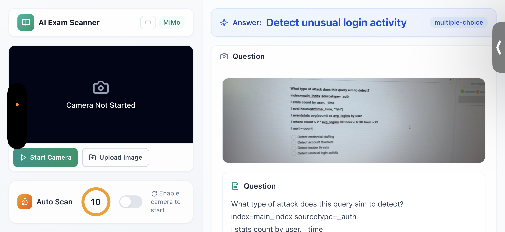

# AI Exam Scanner

<p align="center">
  
</p>

<h1 align="center">AI Exam Scanner</h1>

<p align="center">
  <a href="README.zh.md">中文文档</a>
</p>

---

A modern AI-powered exam scanning tool designed for mobile browsers. Capture or upload question images, and get instant answers with explanations powered by Xiaomi MiMo API.

## Features

- **Camera Scanning**: Real-time camera access with auto-scan timer
- **Question Bank Import**: Import your own question banks (JSON, CSV, TXT, MD formats)
- **Bilingual UI**: Switch between Chinese and English
- **History**: Track your scan history with thumbnails
- **Model Settings**: Configure API key, base URL, and model name
- **Modern UI**: Clean, minimalist design with glassmorphism effects

## Screenshots

### Landscape / Desktop View

<p align="center">
  
</p>

### Mobile View (Portrait)

<p align="center">
  
  &nbsp;&nbsp;&nbsp;
  
</p>

## Quick Start

### Local Development

```bash
npm install
npm run dev
```

Visit `http://localhost:3000`. The camera requires HTTPS on mobile devices.

### Docker Deployment

```bash
# Copy environment file
cp .env.example .env.local

# Edit .env.local with your API key
# MIMO_API_KEY=your_api_key_here

# Build and run
docker compose up -d --build
```

Access at `https://localhost:8443`

## Environment Variables

Copy `.env.example` to `.env.local`:

```bash
MIMO_API_KEY=your_api_key
MIMO_BASE_URL=https://token-plan-sgp.xiaomimimo.com/v1
MIMO_MODEL=mimo-v2.5
```

## Question Bank Format

Supports multiple formats:

### JSON
```json
[
  {
    "question": "What is 1+1?",
    "answer": "2",
    "explanation": "Basic arithmetic"
  }
]
```

### CSV
```csv
question,answer,explanation
"What is 1+1?","2","Basic arithmetic"
```

### TXT/MD
```
1. What is 1+1?
A. 1
B. 2
C. 3
D. 4
Answer: B
Explanation: Basic arithmetic
```

## HTTPS Certificates

For local HTTPS development:

```bash
npm run dev:https
```

When accessing via mobile browser, you'll see a certificate warning. Simply tap "Advanced" or "Continue" to trust the certificate and proceed. No need to install any profiles.

## Tech Stack

- React 18
- Vite
- Tailwind CSS
- Lucide Icons
- Node.js

## License

MIT